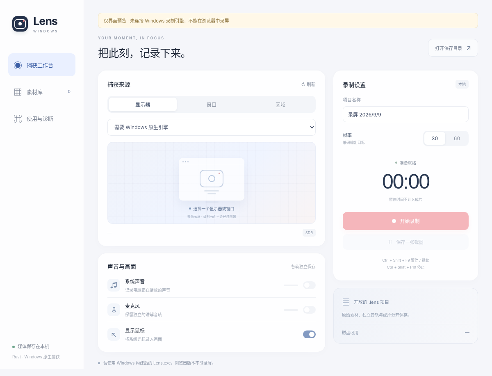

# Lens Windows · Rust 首版工程

**交付状态：源代码实现与构建工程，尚未生成并验证 Windows EXE。不是已经通过真机验收的安装包。**

本工程独立于 `leolemon777/Lens` 的 macOS Swift 工程。它实现 Windows 录制工作台的基础链路，不修改原仓库的 `main`、Swift 文件或 macOS 构建配置。尝试创建远程开发分支时 GitHub 连接返回 `403 Resource not accessible by integration`，因此没有提交、PR、远程构建或下载到的二进制。

当前执行环境没有 Rust 工具链和 Windows 运行环境。下文的“实现”表示源代码已包含相应逻辑，不表示该原生功能已经运行验证。已执行的测试和未执行项严格分列于 [验证记录](docs/VALIDATION.md)。



## 已写入的实现

| 模块 | 源代码范围 | 验证边界 |
|---|---|---|
| 主界面 | 捕获来源、30/60 FPS、声音开关、计时、录制控制、素材库 | 浏览器模拟接口测试已执行 |
| Windows 捕获 | Windows Graphics Capture 显示器/窗口捕获，区域裁剪，PNG 截图 | 未编译、未真机验证 |
| 编码 | `windows-capture` 原生 H.264 编码器、恒定帧率输出 | 未验证编码器及驱动兼容 |
| 音频 | WASAPI 系统 loopback、默认麦克风，独立 PCM16 WAV | 未验证设备兼容和长时间同步 |
| 会话 | 开始、分段暂停、继续、停止，非重入操作保护 | 状态模型及测试源码已编写 |
| 项目 | manifest 0.9、segments 0.1、独立原始素材和派生预览 | 字段对齐，不代表 Mac 双向往返通过 |
| 后处理 | FFmpeg 合并完成分段、系统声封装、麦克风混音 | 组件准备脚本已提供，未运行合成 |
| 异常处理 | 低磁盘检查、来源异常停止、保留原始文件、重试完成分段 | 未做强退/低磁盘真机验收 |
| 桌面集成 | 区域透明窗口、全局快捷键、关闭录制时阻止退出、单实例 | 未验证真实 Windows 窗口行为 |

没有移植：摄像头、自动运镜、光标事件轨、独立鼠标替换、字幕、OCR、智能整理、完整时间线编辑、贴图及标注。请勿把这一版当成 Mac 版功能完全对齐。

## 技术栈

Rust workspace / Tauri 2 / Windows Graphics Capture / `windows-rs` / WASAPI / Windows 原生媒体编码 / FFmpeg 后处理。

前端是嵌入应用的 HTML、CSS、ES Modules，不需要 React 或 Node 才能编译应用；Node 仅用于运行前端单元测试。Tauri 使用 Windows WebView2 渲染界面，**不是使用浏览器 `getDisplayMedia` 录屏**。

首版为容易定位问题的 CPU BGRA 帧交接方案，**没有实现 GPU 零拷贝，也没有验证硬件编码使用情况**。获取画面和编码均在 Rust/Windows 层，前端只接收状态与命令响应。捕获侧用一个最新帧槽位替换旧帧；第三方编码器内部队列尚未做完整内存上限审计，不能据此宣称端到端有界队列。

## 在 Windows 上构建

目标验证平台：Windows 11 x64、SDR 显示器。第一轮请用 1080p / 30 FPS；不能把配置选项视为 4K/60 FPS 已通过。

1. 按 [BUILD.md](docs/BUILD.md) 安装 Rust MSVC 工具链、Visual Studio C++ Build Tools、Windows SDK、WebView2 Runtime。**不需要安装任何工业软件。**
2. 需要系统声、麦克风、分段暂停时，运行 `Prepare-Media.cmd`，检查提示后输入 `YES`。它从指定上游下载 LGPL 标记的 FFmpeg 包，并核验 SHA-256；不上传录制内容。
3. 双击 `Build.cmd`。脚本先执行 Rust 核心测试，再编译，任何一步失败都停止打包。详细输出保存在根目录 `build.log`。
4. **只有构建成功后**才会生成：

```text
 dist/Lens-Windows/Lens.exe
 dist/Lens-Windows-v0.1.0-x64.zip
```

完整复制 `dist/Lens-Windows` 文件夹；不要只拿走 EXE 而漏掉 `tools/ffmpeg/`。首次构建生成的 `Cargo.lock` 会随输出保存；本次源码交付没有伪造 lockfile，因此不是已经锁定完整依赖闭包的可重复二进制构建。

没有 FFmpeg 组件时，代码允许无声单段录制和 PNG 截图，界面禁用声音与分段暂停。并非后台替用户下载组件。

## 保存结构

默认使用当前用户的视频目录下 `Lens-Windows`（没有视频目录时退回文档目录），不依赖固定的 `C:\Users\...`。

```text
20260909_000000_AB12CD34.lens/
  manifest.json                   # schema 0.9
  events/segments.json            # schema 0.1，暂停已移除的时间线
  analysis/windows-session.json   # Windows 选项及物理坐标说明
  raw/segments/0000/
    video.mp4                     # Windows 原生编码的屏幕原片
    system.wav                    # 开启系统声时存在
    microphone.wav                # 开启麦克风时存在
    screen.mp4                    # 分段派生文件，可带系统声
    thumbnail.png
  raw/screen.mp4                  # 完成分段合并结果
  raw/system.wav                  # 开启系统声时合并的独立轨
  raw/microphone.wav              # 开启麦克风时合并的独立轨
  previews/preview.mp4            # 最终基础预览，必要时混入麦克风
  previews/thumbnail.png
  diagnostics/export.log         # 本地 FFmpeg 错误日志
```

截图项目使用 `raw/screenshot.png`。原始 `video.mp4`、系统声音与麦克风分段不因导出失败被删除。派生输出可重建，不代表原始视频在崩溃时一定可播放；正在写入的 MP4 在强退时可能缺少封装信息。当前“重试合成”只处理已经完成且索引有效的分段。

本版没有把 Windows 物理像素直接写成 macOS 的逻辑点 `captureSource`；该可选字段暂不生成，Windows 坐标存入专属侧文件。保留 `.lens` 字段合同不等于已有完整跨平台编辑互操作。

## 快捷键与安全

`Ctrl + Shift + F9`：暂停 / 继续。`Ctrl + Shift + F10`：停止并保存。注册失败会提示使用界面按钮，不记录普通键盘文本。

开始录制要求至少 2 GiB 可用空间；监控检测低于 1 GiB 时尝试停止保存。读盘错误、磁盘耗尽、设备丢失仍可能使最终封装失败，因此请保留项目。没有任何自动删除用户录制的路径。

重试合成仅修改此 Windows 实现创建的项目，不修改未知版本或 macOS 项目。媒体路径经过相对路径及 canonical 路径校验；FFmpeg 使用参数数组调用而非 shell 拼接。应用不提供通用 shell、HTTP 或任意文件读取前端插件。

## 测试和下一步

- `node --test tests/frontend.test.mjs`：可在非 Windows 运行的前端纯逻辑/命令接线检查。
- `python tests/ui_smoke.py`：Chromium 中使用明确的模拟 Tauri 接口验证交互，**不是原生录制测试**。
- `cargo test -p lens-core`：核心测试；本次环境未能执行。
- [ACCEPTANCE.md](docs/ACCEPTANCE.md)：Windows 真机验收清单。
- [ARCHITECTURE.md](docs/ARCHITECTURE.md)：模块与时钟设计。
- [VALIDATION.md](docs/VALIDATION.md)：本次真实测试记录。
- [AGENTS.md](AGENTS.md)：在 Windows 编码环境继续构建验证时必须保留的边界。

`.github/workflows/windows.yml` 是独立 Windows 仓库可用的构建定义，**本次未触发、未运行**；不要直接覆盖 Mac 仓库已有工作流。
