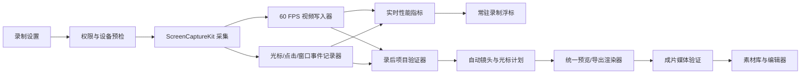

# Lens 录屏可靠性与“苹果式丝滑”改造计划

> 文档版本：v0.1  
> 日期：2026-08-12  
> 范围：macOS 首发版，本轮不进行 Windows 迁移  
> 证据基线：[桌面录屏软件真机对比-2026-08-12.md](./桌面录屏软件真机对比-2026-08-12.md)

## 1. 结论先行

Lens 最新工作区构建的自动运镜、光标重绘和点击波纹已经真正生效，核心方向是对的。当前不应继续堆大量入口和开关，而应先解决四个会直接损害信任的问题：

1. `/Applications` 旧版与工作区新版同时存在，用户无法确认自己打开的是哪一版。
2. UI 显示 60 FPS，但真实原始媒体只有约 29.97 FPS。
3. 输入事件监听可以静默失败，仍然会显示“自动运镜已完成”。
4. 运动模糊强度过高，且缩放模糊与平移模糊叠加，导致返回全景时全画面发糊。

本计划先完成 P0 可靠性，再完成 P1 丝滑度，最后补齐 P2 顶级付费软件能力。任何智能效果都必须用项目文件和成片验证，不再以“UI 已开启”作为完成标准。

## 2. 产品更改计划

| 优先级 | 更改项 | 用户可感知结果 | 发布条件 |
|---|---|---|---|
| P0 | 版本唯一性 | 不再打开旧版；设置页能看到版本、build、构建时间和通道 | 旧版/新版冲突可检测，安装后签名和哈希一致 |
| P0 | 事件轨健康检查 | 光标跟踪受限时当场说明，原始录屏仍有可见光标 | 禁用输入监控时不静默失败，不丢原始媒体 |
| P0 | 真实 60 FPS | 选 60 时成片真正达到 60；设备无法支撑时明确降级 | 真机动态场景输出平均帧率≥58，无时间戳倒退 |
| P0 | 运动模糊修复 | 推近、跟随、回退不再整屏糊掉 | 模糊只出现在速度峰值，静止帧和镜头落点保持清晰 |
| P1 | 自动运镜重新调校 | 默认 1.6×，不眩、不抽动、不频繁进出 | 快速连续点击合并成一个镜头节拍，镜头无速度突变 |
| P1 | 录制浮标真常驻 | 切换任何窗口/Space 都在，除非手动隐藏 | 暂停、继续、隐藏、停止在多桌面稳定 |
| P1 | 后台窗口选择 | 窗口列表只出现可用的真实窗口，后台 App 可选 | 过滤同 bundle ID 的自己窗口，失效选项自动刷新 |
| P1 | 真实状态和错误文案 | 只报告真正生效的运镜、光标、点击和字幕 | 事件轨为空时不显示“智能效果已完成” |
| P1 | 性能和主线程治理 | 启动、拖动、缩放、停止和进编辑器无明显卡顿 | 交互期间主线程无连续 >50 ms 卡顿，空转 CPU <3% |
| P2 | 付费级后期控制 | 自动镜头可逐段修改、禁用、重生成，光标/点击可调 | 手动修改不破坏原事件轨，支持撤销/重做 |
| P2 | 声音和字幕精修 | 人声增强、降噪、自动分句、字幕样式和安全区 | 预览/导出一致，原始音频永不被覆盖 |
| P2 | 项目恢复与发布质量 | 崩溃后可恢复，导出可重试，旧项目可打开 | 安装、升级、恢复、签名和回滚清单全部通过 |

## 3. 目标代码链路



关键规则：

- 原始录屏是第一优先级；任何智能分析失败都不得损坏原始媒体。
- 录制时展示“正在尝试什么”，录后只展示“实际完成了什么”。
- 预览和导出使用同一份 `AutoEditPlan` 和同一组曲线，不允许两套视觉结果。
- 新字段保持向后兼容；旧 `.lens` 项目即使没有诊断信息也能打开。

## 4. 代码实施计划

### C01：构建身份、安装一致性和单实例

#### 修改文件

- `Scripts/build-app.sh`
- 新增 `Scripts/install-local-app.sh`
- 新增 `Scripts/verify-installed-app.sh`
- 新增 `Sources/LensMac/Support/BuildIdentity.swift`
- 新增 `Sources/LensMac/Support/ApplicationInstanceCoordinator.swift`
- `Sources/LensMac/AppDelegate.swift`
- `Sources/LensMac/UI/PermissionCenterView.swift`

#### 代码逻辑

1. 构建时写入 `version`、`buildNumber`、`gitCommit`、`builtAt`、`channel` 和二进制 CDHash，不再所有本地包都使用 build `1`。
2. App 启动时检查相同 bundle ID 的正在运行实例：
   - 同一可执行路径：激活已有实例，当前进程正常退出。
   - 不同路径或 build：显示冲突信息，用户明确选择激活旧版或退出旧版后继续；不在后台直接强杀进程。
3. 安装脚本只操作精确路径 `/Applications/Lens.app`，先复制到临时目录，验证签名/哈希/可启动性后再替换。
4. 设置页固定显示当前运行路径和 build，让测试人员一眼确认版本。

#### 新增核心类型

```swift
struct BuildIdentity: Codable, Equatable {
    let version: String
    let buildNumber: String
    let gitCommit: String
    let builtAt: Date
    let channel: BuildChannel
    let executableURL: URL
}

enum InstanceConflict {
    case none
    case sameBuild(NSRunningApplication)
    case differentBuild(running: BuildIdentity, current: BuildIdentity)
}
```

### C02：输入监控权限与事件轨健康度

#### 修改文件

- `Sources/LensMac/Support/PermissionCenterModel.swift`
- `Sources/LensMac/UI/PermissionCenterView.swift`
- `Sources/LensMac/Capture/PointerEventRecorder.swift`
- `Sources/LensMac/Capture/ScreenRecordingService.swift`
- `Sources/LensMac/UI/RecordingControlView.swift`
- `Sources/LensMac/UI/RecordingControlWindowController.swift`
- `Sources/LensMac/AppDelegate.swift`

#### 代码逻辑

1. 权限中心新增“输入监控”，使用 `CGPreflightListenEventAccess()` 查看状态，只在用户点击“允许”时调用 `CGRequestListenEventAccess()`。不再把 `AXIsProcessTrusted()` 等同于事件监听可用。
2. `PointerEventRecorder.start()` 必须检查全局 monitor token 是否创建成功，并暴露计数、最后事件时间和写入错误。
3. 录制后每 500 ms 轻量取样鼠标位置。如果位置已明显变化，但事件计数持续为 0，状态从 `.waitingForActivity` 转为 `.degraded(.eventsNotDelivered)`。
4. 录制开始前如已知事件监听不可用：
   - 把 `SCStreamConfiguration.showsCursor` 设为 `true`，确保原始录屏仍有光标。
   - 将“自动运镜/光标重绘”标记为降级，不伪造智能效果。
5. 录制停止时不以“点击数为 0”单独判失败，因为用户可能真的没点击；结合权限、monitor 状态、鼠标位置变化和写入错误判断。
6. 事件采集不记录文字内容；键盘轨继续只保留快捷键所需的结构化信息，不扩大隐私范围。

#### 新增核心类型

```swift
enum EventCaptureHealth: Equatable, Sendable {
    case checking
    case waitingForActivity
    case healthy(pointerCount: Int, clickCount: Int)
    case degraded(EventCaptureFailure)
}

struct EventCaptureSnapshot: Equatable, Sendable {
    let pointerCount: Int
    let clickCount: Int
    let windowCount: Int
    let lastEventAt: ContinuousClock.Instant?
    let writerFailureDescription: String?
}
```

### C03：用自定义媒体写入链路兑现真 60 FPS

#### 修改文件

- `Sources/LensMac/Capture/ScreenRecordingService.swift`
- 新增 `Sources/LensMac/Capture/ScreenVideoTrackWriter.swift`
- 新增 `Sources/LensMac/Capture/CapturePerformanceMonitor.swift`
- `Sources/LensMac/Capture/RecordingSegmentAssembler.swift`
- `Sources/LensCore/LensManifest.swift`
- `Sources/LensCore/LensProjectStore.swift`
- `Sources/LensMac/UI/RecordingControlView.swift`

#### 代码逻辑

1. 不再依赖 `SCRecordingOutput` 来假设 `minimumFrameInterval = 1/60` 就能得到 60 FPS。
2. 给 `SCStream` 添加 `.screen` 输出，由 `ScreenVideoTrackWriter: SCStreamOutput` 接收完整帧，检查 `SCStreamFrameInfo.status == .complete` 后交给 `AVAssetWriter`。
3. `ConstantFrameRateScheduler` 把完整帧映射到严格的 `n / targetFPS` 时间网格：
   - 动态内容优先使用最新完整帧。
   - 静态内容没有新帧时复用上一张像素缓冲，保持恒定帧率和音视频时长。
   - 不允许 presentation timestamp 倒退或重复。
4. 系统音频继续从 `.audio` stream output 获得，与视频共用录制时钟写入同一 MP4；麦克风和摄像头仍保留独立轨道。
5. 暂停/继续仍每段单独 finalize，`RecordingSegmentAssembler` 使用段内媒体实际时长拼接，不把暂停时间写进成片。
6. 实时统计三个指标：采集到达 FPS、实际写入 FPS、过期/丢弃帧数。浮标默认只显示绿/黄/红状态，详细数字放在诊断信息中。
7. 60 FPS 连续不达标时不伪造数据：保留完整原始录屏，录后标记“实际 30 FPS”，并在下次录制前建议关闭高负载效果或切换 30 FPS。

#### 帧率计算

`nominalFrameRate` 不作为唯一依据。录后扫描视频 sample timestamp：

```swift
actualFPS = Double(sampleCount - 1) / (lastPTS - firstPTS).seconds
frameIntervals = zip(pts, pts.dropFirst()).map { previous, current in
    current - previous
}
p95FrameInterval = percentile(frameIntervals, 0.95)
```

60 FPS 合格需同时满足：平均帧率≥58、P95 帧间隔≤34 ms、时间戳单调递增，且抽帧视觉不是长时间重复动态画面。

### C04：项目级录制健康报告和真实文案

#### 修改文件

- `Sources/LensCore/LensManifest.swift`
- `Sources/LensCore/LensProjectStore.swift`
- 新增 `Sources/LensMac/Capture/RecordingArtifactValidator.swift`
- `Sources/LensMac/AppDelegate.swift`
- `Sources/LensMac/UI/LensLibraryView.swift`
- `Sources/LensMac/UI/VideoEditorModel.swift`

#### 数据结构更改

`LensCaptureMetadata.framesPerSecond` 保留用于解码旧项目，新项目增加：

```swift
public let requestedFramesPerSecond: Int?
public let measuredFramesPerSecond: Double?
public let p95FrameIntervalMilliseconds: Double?
public let droppedFrameCount: Int?
```

将 `LensManifest.captureSource` 改为可更新字段，在媒体 finalize 后写回实测数据。Schema 版本从 `0.8` 升级，自定义 `Decodable` 规则为：

- 旧 `framesPerSecond` 存在且新字段不存在：只当作 requested，不推断 measured。
- 新字段缺失：编辑器正常打开，健康状态显示“未检测”。
- 实测值不得覆写用户当时的 requested 设置。

项目内新增 `diagnostics/recording-health.json`，并向 `LensAsset.Role` 增加 `.recordingHealth`。

```swift
struct RecordingHealthReport: Codable, Equatable, Sendable {
    let requestedFPS: Int
    let measuredFPS: Double?
    let videoStatus: ComponentStatus
    let eventStatus: ComponentStatus
    let pointerEventCount: Int
    let clickEventCount: Int
    let effectiveCameraKeyframeCount: Int
    let cursorKeyframeCount: Int
    let clickPulseCount: Int
    let warnings: [RecordingHealthWarning]
}
```

#### 验证顺序

1. 原始媒体存在、可解码、时长 > 0、时间戳正常。
2. 各 JSONL 可解析，行数和最后时间在媒体时长内。
3. 自动镜头除 baseline 外存在有效关键帧，才算“自动运镜完成”。
4. 光标和点击也分别以成片计划中的 keyframe/pulse 数量判定。
5. 只根据上述结果生成 toast 和素材库 badge；事件轨失败时文案为“原始录屏已保存，智能跟踪未生效”。

### C05：自动运镜改为低眩晕、有节拍的摄影机

#### 修改文件

- `Sources/LensCore/AutoCameraPlanner.swift`
- `Sources/LensCore/EffectTimeline.swift`
- `Sources/LensCore/CaptureEvents.swift`
- `Sources/LensMac/Support/AppModel.swift`
- `Sources/LensMac/UI/VideoEditorModel.swift`

#### 默认参数

| 模式 | 默认倍率 | 推近 | 最小停留 | 回退 | 运动模糊 |
|---|---:|---:|---:|---:|---:|
| 平滑（自然成片） | 1.60× | 0.52 s | 1.70 s | 0.78 s | 0.12 |
| 聚焦演示 | 1.60× | 0.40 s | 1.35 s | 0.64 s | 0.16 |
| 积极 | 1.60× | 0.32 s | 1.05 s | 0.52 s | 0.18 |

具体逻辑：

1. **点击聚类**：800 ms 内且距离小于画面短边 8% 的连续点击合并为一个 focus beat，延长停留而不是反复进出。
2. **安全区和迟滞**：光标在中央安全区内不移动相机；离开外层阈值后才跟随，回到内层阈值后才停止，消除边界抖动。
3. **加速度限制**：相机中心先计算目标轨迹，再进行速度和加速度 clamp；不直接追每个原始光标点。
4. **按语义停留**：点击后优先留在结果区域，只有新目标超出安全区或停留超时才转镜。
5. **可编辑优先**：用户手动修改过的镜头段设为 locked，重新分析时仅生成未锁定区间。
6. **时间线确定性**：新曲线要 seek-safe，同一时间点的输出不依赖前一帧状态，确保拖动预览和导出完全一致。

`EffectTimeline` 新增明确曲线名，老项目的 `spring-smooth` / `spring-gentle` 继续支持：

```swift
enum CameraEasing: String, Codable {
    case linear
    case smoothstep
    case easeOutQuint
    case easeInOutSmootherstep
    case criticallyDamped
}
```

### C06：运动模糊从“滤镜强度”改为“速度能量预算”

#### 修改文件

- `Sources/LensMac/Capture/AutoPreviewRenderer.swift`
- `Sources/LensCore/CaptureEvents.swift`
- `Sources/LensMac/Support/AppModel.swift`
- `Sources/LensMac/UI/VideoEditorView.swift`

#### 代码逻辑

当前渲染器会同时叠加 `CIZoomBlur` 和 `CIMotionBlur`，且半径上限达 24/32 px。改为：

1. 用实际输出帧间隔取样相机，不再固定按 `1/30` 估算速度。
2. 平移速度和对数缩放速度分别归一化，小于阈值时模糊为 0。
3. 每帧只选主导运动方向：缩放占优时使用 zoom blur，平移占优时使用 motion blur；不再两者满强度叠加。
4. 1380p 预设最大模糊半径：自然成片 8 px，聚焦演示 11 px，积极 14 px，再按输出分辨率成比例缩放。
5. 模糊能量在动画起点和落点必须回到 0，只在速度中段出现。
6. 先渲染底层画面模糊，后绘制光标、点击波纹、字幕和注释，前景信息始终清晰。

```swift
blurEnergy = presetStrength
    * velocityEnvelope(normalizedCameraVelocity)
    * endpointFade(animationProgress)

if zoomVelocity > panVelocity {
    applyZoomBlur(radius: min(blurEnergy * zoomCap, zoomCap))
} else {
    applyDirectionalBlur(radius: min(blurEnergy * panCap, panCap))
}
```

### C07：窗口选择器和常驻浮标收尾

#### 修改文件

- `Sources/LensMac/UI/RecordingWindowPickerModel.swift`
- `Sources/LensMac/UI/RecordingSetupView.swift`
- `Sources/LensMac/UI/RecordingControlWindowController.swift`
- `Sources/LensMac/UI/RecordingControlView.swift`

#### 代码逻辑

- 窗口选择从仅排除当前 PID，改为排除同 bundle ID 的所有 Lens 窗口。
- 优先排序：前台普通 App > 当前 Space 可见窗口 > 后台普通 App > 系统辅助窗口。
- 缩略图任务限流并取消已过期请求；窗口刷新不阻塞主线程。
- 录制浮标的 `NSPanel` 使用 `.canJoinAllSpaces` 和 `.fullScreenAuxiliary`，窗口 level 统一由 controller 管理；用户点击隐藏前始终在线。
- 浮标更新频率限制在 15–20 Hz，时间、音量、帧率和事件健康状态合并为一次 `@Published` 刷新，避免 SwiftUI 重复布局。

### C08：性能基线和用户可感知丝滑度

#### 修改文件

- `Sources/LensMac/AppDelegate.swift`
- `Sources/LensMac/UI/VideoEditorPlaybackController.swift`
- `Sources/LensMac/UI/VideoEditorModel.swift`
- `Sources/LensMac/Capture/AutoPreviewRenderer.swift`
- `Sources/LensCore/DiagnosticEvent.swift`
- `Scripts/run-g0-baseline.sh`
- `Scripts/summarize-capture-performance.swift`

#### 代码逻辑

- 给快捷键触发→overlay 首帧、鼠标按下→选区首帧、点停止→媒体 finalize、进编辑器→预览首帧加 signpost。
- 视频分析、JSONL 解析、缩略图、编码和光学模糊都在后台 actor/queue 运行；主线程只接收合并后的可视状态。
- 分析任务可取消；调整倍率时取消旧计划并生成带 generation ID 的新计划，旧结果不能回填覆盖新倍率。
- 分析过程中继续显示上一份可用预览，新结果完成后原子切换，不让编辑器长时间空白。
- 空闲时停止 display link、定时器和重复观察任务，保持编辑器空转 CPU <3%。

## 5. 测试计划

### 新增单元/集成测试

| 测试文件 | 覆盖范围 |
|---|---|
| `BuildIdentityTests.swift` | build metadata 解析、旧/新版冲突、同实例激活 |
| `PointerEventRecorderHealthTests.swift` | monitor 创建失败、位置已变但零事件、writer 错误 |
| `ScreenVideoTrackWriterTests.swift` | 30/60 时间网格、静态帧复用、时间戳单调性、音视频对齐 |
| `CapturePerformanceMonitorTests.swift` | 滚动 FPS、P95 帧间隔、丢帧和健康级别 |
| `RecordingArtifactValidatorTests.swift` | 空事件轨、只有 baseline、媒体损坏、真实完成项 |
| `AutoCameraPlannerTests.swift` | 连续点击聚类、安全区迟滞、速度/加速度上限、锁定段 |
| `EffectTimelineTests.swift` | 新 easing 的 seek-safe、边界连续和老项目解码 |
| `AutoPreviewRendererTests.swift` | 模糊能量上限、起落点清晰、前景光标/字幕不被模糊 |
| `RecordingControlViewTests.swift` | 健康状态、降级文案、VoiceOver label、更新合并 |
| `RecordingWindowPickerModelTests.swift` | 同 bundle 过滤、后台窗口、失效选择和任务取消 |

### macOS 真机端到端矩阵

1. **30 FPS / 60 FPS**：Safari 快速滚动 + 窗口拖动 + 鼠标快速移动，各录 60 秒，同时检查原始轨和导出轨。
2. **事件权限取消**：屏幕录制允许、输入监控拒绝，验证降级提示、原始光标和媒体保存。
3. **暂停/继续**：至少三段，每段均包含系统声和事件，验证无黑帧、无音频断裂和时间轴偏移。
4. **自动运镜**：单击、连续点击、长距离转场、无点击光标跟随四类脚本，检查 1.6× 和镜头节拍。
5. **多窗口/多 Space/全屏**：浮标保持在线，手动隐藏后不再出现，快捷键可恢复。
6. **旧项目兼容**：打开 schema 0.8 及以前项目，不伪造 measured FPS，编辑和导出仍正常。
7. **崩溃/磁盘满/编码失败**：原始分段可恢复，项目显示明确状态，不会卡在“正在分析”。

### 丝滑度验收指标

| 指标 | 目标 |
|---|---:|
| 快捷键触发到截图 overlay 首帧 | P95 ≤ 120 ms |
| 选区拖动的主线程卡顿 | 无连续 > 33 ms，P95 帧时间 ≤ 16.7 ms |
| 录制浮标交互响应 | P95 ≤ 80 ms |
| 60 FPS 成片实测平均帧率 | ≥ 58 FPS |
| 智能镜头转场的整帧模糊 | 无可感知整屏糊化，起落帧与静止帧清晰度差 < 5% |
| 编辑器无播放/无分析时 CPU | < 3% |
| 录制完成后进入可预览状态 | 60 秒素材 P95 ≤ 3 s（先原片后智能版） |

## 6. 执行顺序与提交切片

| 提交 | 内容 | 依赖 | 预估 |
|---|---|---|---:|
| 1 | C01 构建身份、单实例、安装验证 | 无 | 1–1.5 天 |
| 2 | C02 输入监控权限、事件健康度、原始光标降级 | 1 | 1–2 天 |
| 3 | C03 自定义 30/60 FPS 视音频写入器 | 1 | 2–4 天 |
| 4 | C04 录制健康报告、schema 兼容、真实文案 | 2、3 | 1–2 天 |
| 5 | C05/C06 运镜节拍与模糊能量预算 | 4 | 2–3 天 |
| 6 | C07/C08 窗口选择、常驻浮标、主线程性能 | 2–5 | 1.5–2.5 天 |
| 7 | 全量测试、Release 构建、签名检查、真机 E2E | 全部 | 1–2 天 |

预计 P0 + P1 为 9.5–17 个工程日。这个数字包含真机反复验收，不包含 Windows 迁移和 P2 新增的完整音频算法。

## 7. 每个阶段的停止条件

- **P0 完成**：版本唯一；输入事件不再静默失败；60 FPS 真实兑现；成片无整屏强模糊。
- **P1 完成**：默认 1.6× 自动运镜不眩晕；浮标跨窗口常驻；窗口选择稳定；空转和主线程指标达标。
- **Beta 可发布**：全量测试、Release 构建、签名、安装/升级、崩溃恢复和 macOS 真机 E2E 全部通过，且没有“UI 宣称开启但成片未生效”的功能。

## 8. 当前不做

- 不开始 Windows 平台层迁移。
- 不为了功能数量继续增加不可验证的开关。
- 不覆盖或破坏原始录屏、原始音频和原始事件轨。
- 不在权限缺失或分析失败时伪造“已完成”状态。
- 不以仅通过单元测试代替真机成片验收。

## 9. 执行结果（2026-08-12）

本轮 C01–C08 已完成并进入可用构建，macOS 当前里程碑的代码与自动化质量门已收尾：

- 已安装并签名验证 `/Applications/Lens.app`：`0.1.0 (20260812070826)`。
- 可执行文件 SHA-256：`5888162bfec4a2383403a0cdafd52f829d3702b219d83316a3f60e3fecaff935`。
- 签名 CDHash：`95cee834c01e99a8a92be819f47f775ae3c4c6be`。
- 全量测试：372 项，0 失败；Release 构建以 warnings-as-errors 通过。
- 公开源码审计：201 个跟踪文件通过；公开发布仍需由项目所有者选择许可证并添加 `LICENSE`。
- 真机窗口录制终验：请求 60 FPS，实测 60.06 FPS，P95 帧间隔 16.67 ms，丢帧 0，健康报告 0 警告。
- 停止录制到原始媒体安全完成：72.48 ms；停止瞬间会冻结恒定帧率时钟，不把编码收尾时间写进成片。
- 已验证后台窗口选择、跨 App 常驻浮标、暂停/继续、非破坏性编辑、1.6× 默认运镜、取消旧分析结果和三档 MP4 导出。
- Computer Use 生成的合成鼠标事件不会进入 macOS 全局 `NSEvent` monitor，因此物理鼠标事件链不能由 UI 自动化代替；事件权限降级、健康检查和真实效果计数均已有自动化覆盖，最终人工手感测试仍以真实鼠标为准。

当前剩余不属于本轮代码缺陷：公开 Beta 的许可证法律选择，以及更长时间、多动态内容的人工体验打磨。Windows 迁移继续按范围约束暂缓。

## 10. 2026-08-13 可靠性增量

- 系统音频改为原生 PCM/CAF 原子分片，避免第二个资产写入会话令 ScreenCaptureKit 音频提前停止；正常停止后无重编码合入视频，强杀时只消费已完成分片。
- ScreenCaptureKit 的非交错双声道样本改由原生 `AudioBufferList` 提取，修复普通 PCM 复制 API 返回 `-12731` 的真机失败；同一转换器同时驱动系统声音量表。
- 安装版 60 秒真机门为 60.0 FPS、0 丢帧、3000/3000 音频样本、音画时长差 50 ms；17 秒 `SIGKILL` 后恢复 14.567 秒，恢复媒体的物理音视频轨与非静音检查通过。
- 全量自动回归更新为 423 项、0 失败；最新安装构建为 `0.1.0 (20260813051907)`，本地签名与安装哈希验证通过。
- 这组短时证据只关闭“短时连续系统音频”和“强杀可恢复”缺陷；后续已补齐一小时严格耐久、真实 `ENOSPC` 与独立窗口来源进程消失，实体音视频设备拔出及 Developer ID 公证仍是 Beta 阻断项。
- G2 的 `passed` 已改为强制联合门槛：视频轨存在、实测帧率达标、零丢帧、物理轨完整、系统声非静音、音画漂移不超过 250 ms、每秒至少 49 个音频回调且回调/接收/写入计数一致、待写样本为 0、峰值物理内存不超过 512 MiB、首尾内存增长不超过 128 MiB、停止到可播放不超过 10 秒，录制期间 4 Hz 主线程心跳的 P95 调度延迟不超过 50 ms且单次最大延迟不超过 250 ms；任意一项不满足都不得报告成功。
- 长录门不再依赖静态桌面：诊断模式会显示一个本地动态色条、计数器和移动标记，停止后按时长均匀解码 6 / 12 / 24 个时间点，所有要求的采样都必须可读，且至少半数画面签名不同；重复静态帧不得伪装成 60 FPS 通过。
- 系统音连续性不再只看整段平均 RMS：音频验证按录制时长均匀解码 5 / 12 / 24 个 PCM 窗口（短测 / 5 分钟级 / 1 小时级），每个窗口都必须有可测声音，并且受控音频激励进程必须覆盖整段录制。动态画面同样按 6 / 12 / 24 个分布点解码验证，避免只验片头而漏掉中后段冻结。
- 麦克风音频引擎配置变化和正在使用的摄像头断开现在会立即进入可观测降级：主屏幕录制继续，界面即时说明原因，结束时保留中断前可读的独立原始轨。
- 安装版严格 60 秒和 5 分钟门已通过：5 分钟写入 17956 帧、60 FPS、0 丢帧，15000/15000 音频样本无积压，12 个音频窗口连续非静音、12/12 动态画面不同，主线程心跳 P95 16.65 ms，停止到可播放 390 ms。
- 最终安装版一小时严格门已通过：实际 3600.077 秒、写入 215543 帧（99.79%）、60.000 FPS、0 丢帧；180002 个系统声样本从原始回调到写入逐项相等且无积压，24 个分布音频窗口全部非静音、24/24 分布画面签名不同；音画差 36.7 ms，主线程心跳 P95 16.63 ms、最大 21.11 ms，峰值物理内存约 174.7 MiB，停止到可播放 5.047 秒。全部联合硬门为真，报告绑定安装构建 `0.1.0 (20260813070311)`。
- 安装版真实 75.233 秒多 App 录屏发现并关闭了 source-quality 合成回落 30 FPS 的缺陷：H.264 B 帧重排素材现由原始视频轨提供合成时钟，原片和智能效果成片均实测 60.000 FPS。最终编码反事实验证中自动运镜、光标、点击反馈与画布全部 `verified`，健康报告无警告；对应的带 B 帧 60 FPS 回归已进入测试集。
- 光标成片基线提升为源宽的 `2.1%`（最小 36 px、最大 104 px），反事实采样按“变化像素数 × 期望差异”选择最具可见性的时刻；无光标负样本仍会失败。真实 Retina 成片验证光标 512 个变化像素、相似度增益 `0.956`，点击反馈 172 个变化像素、相似度增益 `0.886`。
- 真机把倍率从 `1.60×` 改为 `1.65×` 后，UI 状态、计划相机倍率及全部自动点击关键帧同时变化，证明参数进入重新规划链路；测试后恢复默认 `1.60×`。该真实项目 11 个转场通过运镜舒适度审计，0 个压缩回程、0 个质量问题。
- 新增 `--g3-rendered-effects` 安装版诊断入口和 `Scripts/run-g3-rendered-effects.sh`：真实项目在独立输出中重渲染，不改项目，联合要求非空输出、至少一项真实请求效果、命令行指定的每项必要效果全部最终编码验证通过、帧率达标且运镜舒适。构建 `20260813090147` 对同一 75.233 秒项目跑完原画/平衡/轻量三档，分别得到 60/30/24 FPS，三档均为自动运镜/光标/点击/画布 4/4 效果通过；报告为 `Build/Quality/g3-real-effects-installed-{source,balanced,compact}.json`。
- G3 另在真实 27.205 秒摄像头/麦克风项目验证画布、画中画和音频混音三项通过：画中画反事实变化 14390 像素，混音比较 600000 个 PCM 样本且音频漂移 13.3 ms。字幕用真实 25.64 秒录屏加内存中已校对诊断文本验证最终编码变化 10655 像素；报告明确区分 `diagnosticAuthoredText` 与项目转写，避免把字幕渲染证据伪装为语音识别证据。
- 视频标注现作为独立 `RenderedEffectKind.videoAnnotation` 进入最终编码门，关闭标注生成逐帧反事实；真实 25.64 秒项目中字幕与矢量标注分别变化 14628 / 8874 像素并独立通过。G3 可用内存诊断字幕/标注验证渲染而不改项目，并分别标注 `diagnosticAuthoredText` / `diagnosticAuthoredOverlay`。
- 新增 `--g3-transcription` 与 `Scripts/run-g3-transcription.sh`。脚本必须经 LaunchServices 启动完整 `.app`，验证用途说明、非静音、本机识别、非空文本、时码边界、预期词命中和本地整理输出；直接运行 Mach-O 会绕开 TCC 的 App 元数据并被系统强杀，禁止作为语音门运行方式。受控普通话证据为 6.575 秒、9 个片段、23 字、8/8 词命中，并生成 2 个标签、1 个要点和 1 个章节；报告不保存原文。
- G3 增加 `--persist-derived-copy` 与 `Scripts/run-g3-project-roundtrip.sh`：对原项目逐文件流式 SHA-256，只在隐藏临时副本通过 `VideoEditorModel` 执行和界面控件一致的倍率、事件镜头重生成、光标、点击、字幕校对与标注操作，再写入 edit plan、transcript、insights；从磁盘重建第二个编辑器模型后才渲染和执行最终编码反事实。任一编辑器操作未入计划、重开状态不一致、角色缺失、必要效果未进入成片或原项目指纹变化都会失败。构建 `20260813093933` 用真实 75.233 秒项目验证 14/14 编辑操作、三类资产、重开状态一致，六项效果 6/6 通过，源项目 10 文件 / 133167521 字节指纹前后一致。
- `RecordingHealthReport 0.4` 新增 `renderedPlanDigest`，由排序 JSON 中的完整编辑计划和实际字幕源生成 SHA-256；`RenderedPreviewExportGate` 要求该摘要与当前编辑器状态完全一致。旧报告无摘要、计划/字幕变化或摘要计算失败都会触发重渲染。真实安装版 G3 同时要求当前摘要通过、只改一个光标倍率后的旧摘要被拒绝，避免旧预览的通过状态授权新参数导出。
- Computer Use 真机链在真实 18.417 秒录屏上执行“素材库打开 → UI 1.60× 改 1.65× → 自动镜头重生成 → 等待媒体门 → 关闭 → 素材库重开 → 系统保存面板导出”。重开后 UI、`edit-plan.json` 和 24 个镜头关键帧均保持 1.65×；健康报告为 `0.4`、摘要非空、四项效果全部 `verified`、60.000 FPS。导出文件与已验证预览 SHA-256 完全一致。测试后通过 UI 恢复 1.60×并再次等到 `ready`，没有遗留测试参数。
- 真实可见 UI 的转写/字幕/混音链暴露了第二个 60 FPS 降级点：大分辨率 H.264 B 帧效果成片进入 `AVAssetExportSession` 音频混合后会静默回落为 30 FPS。`AudioMixdownRenderer` 现在显式创建保持源轨时序的 `AVMutableVideoComposition`，原画预设把 `sourceTrackIDForFrameTiming` 绑定到合成输出轨；平衡/轻量仍按用户选择封顶。新增 2560×1664、H.264 B 帧、120 帧/60 FPS 的真实合成→混音回归，修复前稳定失败为 30 FPS，修复后不低于 58 FPS。
- 构建 `20260813101241` 通过素材库转写、本地整理、编辑器字幕校正、关闭重开、原画渲染、音频混合和系统保存面板导出。短音轨先因 8.005 秒漂移被导出门拒绝；完整音轨的最终成片为 2560×1664、约 59.78 FPS，字幕/运镜/光标/点击/画布/混音 6/6 生效、音画漂移 1.67 ms、0 警告，导出与预览逐字节一致。源转写与原项目指纹未变；证据归档于 `Build/Quality/g3-ui-transcription-caption-mix60-installed-source.json`，并明确只计作受控合成语音 E4，不冒充自然人盲测。
- 当前媒体代码又对真实 60 FPS 项目重跑 G3 round-trip：14 项编辑器变更、保存重开、七项效果、计划摘要新鲜度和源项目不变全部通过；字幕增加 H.264 压缩鲁棒的方向相关性与投影强度双证据，并由故意无字幕的编码反例约束，最终安装候选报告固定写入 `Build/Quality/g3-project-roundtrip-installed-final.json`，避免沿用旧构建绿灯。
- 可访问性 AX 扫查发现部分编辑器滑块只暴露数字，没有说明数字代表留白、圆角、阴影、倍率、音量或平滑窗口。通用 `valueSlider`、转场时长、光标平滑窗口、截图画布和截图效果强度现全部显式暴露名称与格式化值，并新增两条审计回归；高对比度、降低透明度和减少动态快照仍通过。真人 VoiceOver 与完整键盘焦点顺序仍需 E5 人工验证。
- 窗口来源故障门改用独立 helper 进程生成窗口，终止 owning process 后 24.4 ms 检出并安全保存 8.11 秒物理双轨媒体；同进程 `NSWindow.close()` 不再被误当成真正的来源消失证据。
- `ENOSPC` 触发的半写视频 fragment 会事务回滚到上一完整边界，并区分“进程新发现中断”与“写入器已标记中断”的恢复状态；真实 25 MiB 可用空间的有界卷再验恢复 22.43 秒可播、物理双轨完整媒体。
- 不可恢复的空屏幕媒体项目不再每次启动重复尝试：首次失败后状态原子推进为 `failed`，完整项目包不删除；非空但当前不可读的媒体继续保留 `interrupted`。真实历史候选已隔离且下次候选查询为 0。
- 最终源码全量 464 项测试、公开源码审计和 warnings-as-errors Release 构建通过。最终安装构建身份以最后生成的 `release.json` 和 `g3-project-roundtrip-installed-final.json` 为准，并须通过安装一致性校验和真实 60 FPS G3 round-trip；本地严格签名通过，G4 锁屏反例正确 blocked。可选麦克风/摄像头故障现按会话降级，启动竞态或中途断开不再拖垮主录屏，暂停/继续也不会重开本次已失败设备，最终健康报告会记录轨道中断。实体设备拔出仍需真机正例。Developer ID / 公证未具备；一小时耐久证据仍绑定捕获链路构建 `20260813070311`，最终发布 commit 需重新跑一次对应报告。
- 发布脚本现把未跟踪的参与构建源码也计入 dirty 判定，并把全部已跟踪文件及未跟踪但未忽略文件计算为确定性源码快照 SHA-256；构建前后摘要必须相同。开发验证允许清单诚实声明 dirty，但要求摘要与当前快照逐字一致；公开验证仍强制 clean。最新开发候选的 DMG/App ZIP/dSYM/清单/说明/校验和已完成独立解包与只读挂载复验，公开反向门按预期一次汇总 15 个资格阻断；最终构建号与摘要以最后生成的 `release.json` 为准。
- 历史归档验证改为由归档元数据绑定 Git commit 与源码快照摘要，并脱离当前工作区校验制品；当前源码变化不再误伤旧归档，归档内容篡改反例仍由 SHA-256 硬失败。
